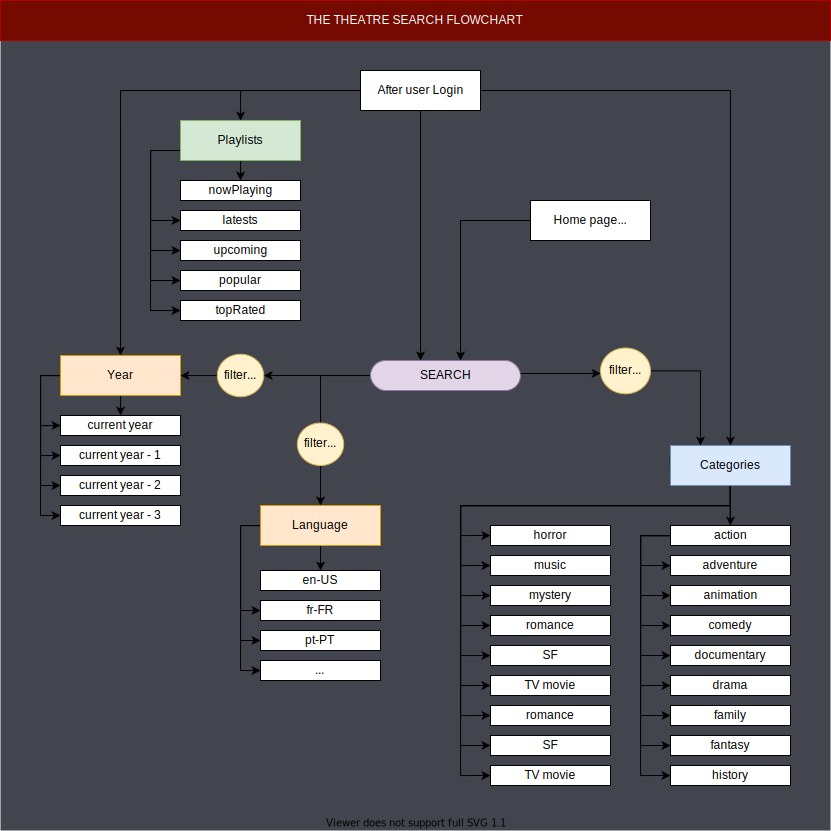

# searchFlix ([DEMO]())

This is a standalone version of the search and filtering functionality for [The Theatre student group project](https://github.com/gonzalovsilva/getflixProject).

This project makes use of the [themoviedb api](https://www.themoviedb.org/documentation/api).

## step 1 - Working search :

## step 2 - Working search with global categories :

## step 3 - Fully working search and filtering :

- First you have a `find by` choice between Playlists and Categories.
- Then if you search by something, it becomes a `filter by` choice. Here you can combine a category with a year.

